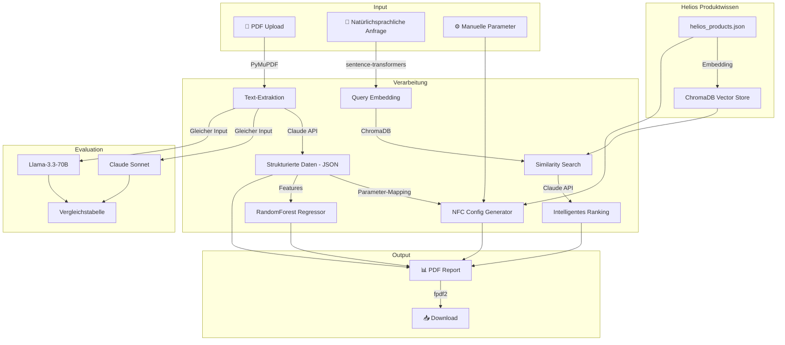

# Architektur & Modellauswahl

## Systemübersicht

## Modellauswahl-Begründungen

### LLM: Claude Sonnet 4.6 (Primary)
- **Stärke:** Zuverlässigstes JSON-Output-Format, exzellente Deutsch-Kompetenz
- **Trade-off:** Höhere Kosten als Open-Source, API-Abhängigkeit
- **Alternative evaluiert:** Llama-3.3-70B via Groq – schneller/günstiger, aber weniger zuverlässig bei strukturierter Extraktion

### Embeddings: sentence-transformers/all-MiniLM-L6-v2
- **Stärke:** Lokal, kostenlos, keine API-Latenz, kein Vendor-Lock
- **Trade-off:** Nicht spezialisiert auf Deutsch/Lüftungstechnik
- **Alternativen:** voyage-3, text-embedding-3-large – besser, aber API-abhängig

### Vector Store: ChromaDB
- **Stärke:** In-Memory, kein Server, persistent möglich, Python-native
- **Trade-off:** Nicht für Millionen Dokumente skalierbar
- **Ausreichend:** 15 Produkte → In-Memory ChromaDB ist optimal

### ML: RandomForest Regressor
- **Stärke:** Interpretierbar (Feature Importance), robust bei kleiner Datenmenge (n=60), kein Overfitting-Risiko
- **Trade-off:** Keine Extrapolation über Trainingsbereich
- **Warum kein Neuronales Netz:** Bei n=60 synthetischen Samples wäre jedes NN massiv overfitted

### PDF-Parsing: PyMuPDF
- **Stärke:** Schnellste Python-Bibliothek, zuverlässig, Open Source
- **Alternative:** pdfplumber (bessere Tabellen), aber langsamer
